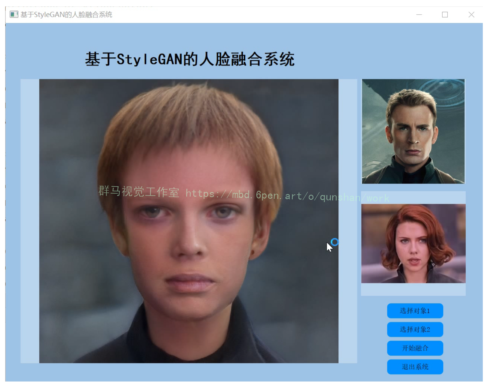
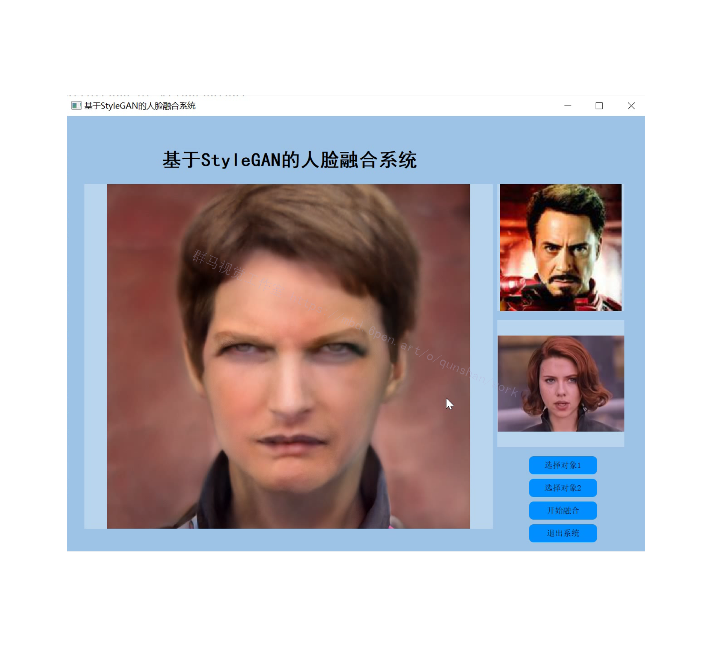
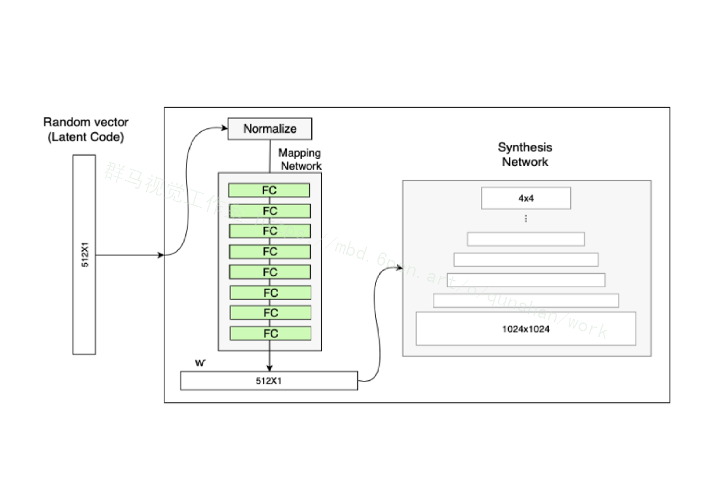
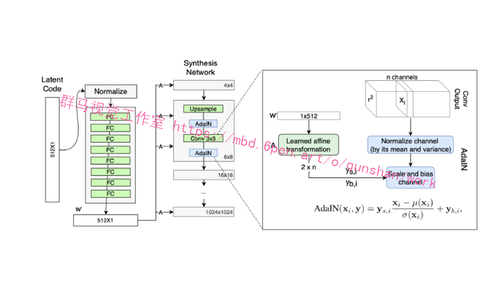
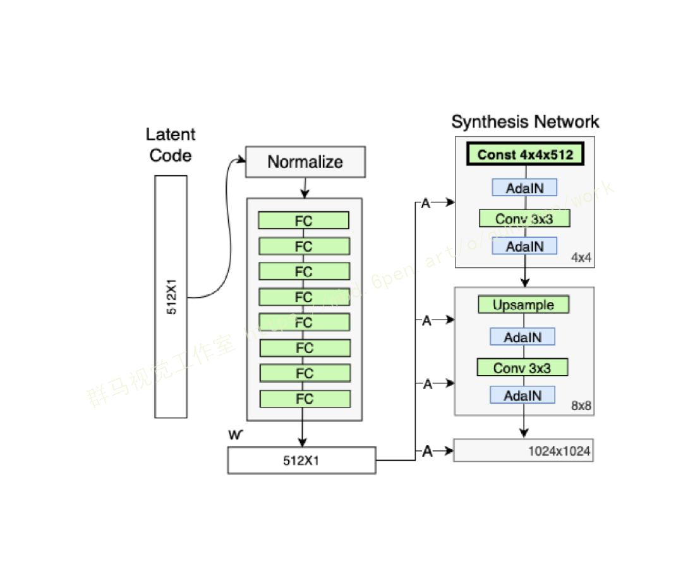
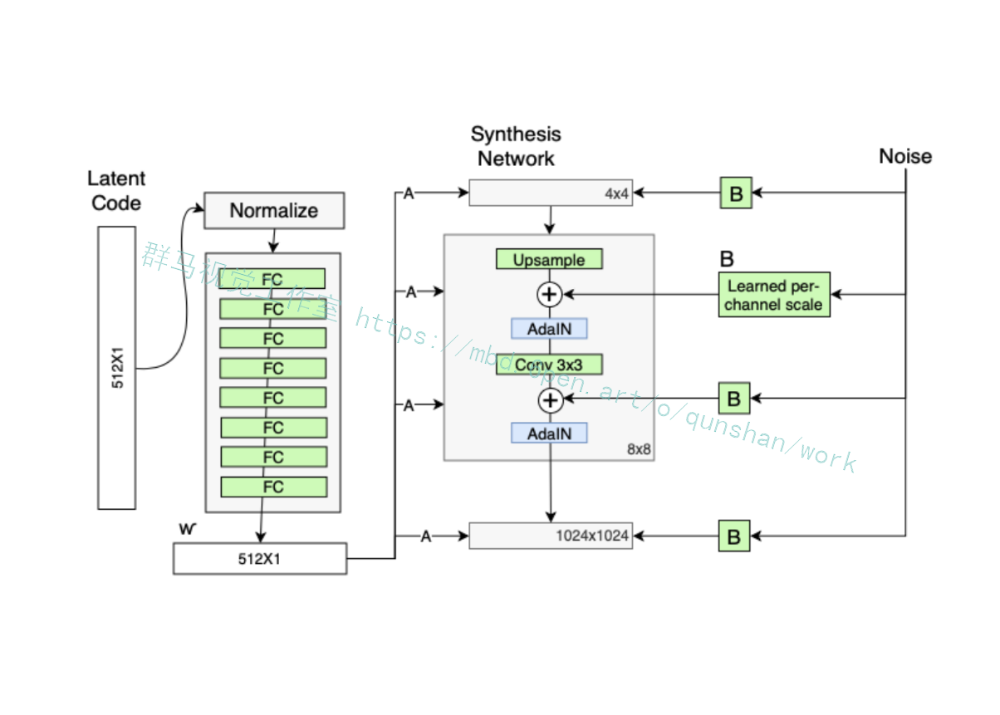

# 1.研究背景
针对人脸融合过程中出现的侧面图像无法正常融合及肤色融合的问题,利用StyleGAN生成式对抗网络源图像人脸的倾角对目标图像人脸进行变换和生成,保证源与目标图像人脸倾角的一致性,同时在生成过程中引入对抗损失与对称损失统一性保留的损失组合,保证生成人脸图像的身份判别稳定.选取了Multi-Pie人脸数据集进行实验,实验表明:改进StyleGAN网络后,相对于传统的人脸融合算法在人脸多角度融合问题方面得到了有效的提高,解决了目标人脸图像为侧面图时无法完美融合的问题.

# 2.图片演示




# 3.视频演示

[改进StyleGAN的人脸融合系统（教程＆源码）_哔哩哔哩_bilibili](https://www.bilibili.com/video/BV1oe4y1v7VM/?vd_source=bc9aec86d164b67a7004b996143742dc)

# 4.StyleGAN简介

StyleGAN 用风格（style）来影响人脸的姿态、身份特征等，用噪声 ( noise ) 来影响头发丝、皱纹、肤色等细节部分。

StyleGAN 的网络结构包含两个部分，第一个是Mapping network，即下图 (b)中的左部分，由隐藏变量 z 生成 中间隐藏变量 w的过程，这个 w 就是用来控制生成图像的style，即风格，为什么要多此一举将 z 变成 w 呢，后面会详细讲到。 第二个是Synthesis network，它的作用是生成图像，创新之处在于给每一层子网络都喂了 A 和 B，A 是由 w 转换得到的仿射变换，用于控制生成图像的风格（1.2），B 是转换后的随机噪声，用于丰富生成图像的细节，例如：雀斑、皱纹（1.4），即每个卷积层都能根据输入的A来调整"style"，通过B来调整细节。整个网络结构还是保持了 PG-GAN （progressive growing GAN） 的结构。

# 5.算法改进

#### 在[源码](https://mbd.pub/o/bread/Y5qZl55r)的基础上加入了Mapping Network

Mapping network 要做的事就是对隐藏空间（latent space）进行解耦

首先理解latent code ：
latent code 简单理解就是：为了更好的对数据进行分类或生成，需要对数据的特征进行表示，但是数据有很多特征，这些特征之间相互关联，耦合性较高，导致模型很难弄清楚它们之间的关联，使得学习效率低下，因此需要寻找到这些表面特征之下隐藏的深层次的关系，将这些关系进行解耦，得到的隐藏特征，即latent code。由 latent code组成的空间就是 latent space。



StyleGAN的第一点改进是，给Generator的输入加上了由8个全连接层组成的Mapping Network，并且 Mapping Network 的输出 W' 与输入层（512×1）的大小相同。

添加 Mapping Network 的目标是将输入向量编码为中间向量，并且中间向量后续会传给生成网络得到 18 个控制向量（为什么18个? 看1.2AdaIN），使得该控制向量的不同元素能够控制不同的视觉特征。为何要加 Mapping Network 呢？因为如果不加这个 Mapping Network 的话，后续得到的 18个控制向量之间会存在特征纠缠的现象——比如说我们想调节 8*8 分辨率上的控制向量（假设它能控制人脸生成的角度），但是我们会发现 32*32 分辨率上的控制内容（譬如肤色）也被改变了，这个就叫做特征纠缠。所以 Mapping Network 的作用就是为输入向量的特征解缠提供一条学习的通路。

★ 为何 Mapping Network 能够学习到特征解缠呢？简单来说，如果仅使用输入向量来控制视觉特征，能力是非常有限的，因此它必须遵循训练数据的概率密度。
例如，如果黑头发的人的图像在数据集中更常见，那么更多的输入值将会被映射到该特征上。因此，该模型无法将部分输入（向量中的元素）映射到特征上，这就会造成特征纠缠。然而，通过使用另一个神经网络，该模型可以生成一个不必遵循训练数据分布的向量，并且可以减少特征之间的相关性。

#### [加入了样式模块AdaIN](https://afdian.net/item?plan_id=fc1870ea582011edb50852540025c377)



    StyleGAN 的第二点改进是，将特征解缠后的中间向量𝑊′变换为样式控制向量，从而参与影响生成器的生成过程。
     生成器由于从 4*4 ，变换到 8*8 ，并最终变换到 1024*1024 ，所以它由 9 个生成阶段组成，而每个阶段都会受两个控制向量（A ）对其施加影响，其中一个控制向量在 Upsample之后对其影响一次，另外一个控制向量在 Convolution 之后对其影响一次，影响的方式都采用 AdaIN （自适应实例归一化）。因此，中间向量 𝑊 ′ 总共被变换成 18 个控制向量（A）传给 生成器。
    其中 AdaIN 的具体实现过程如上右图所示：将 𝑊 ′通过一个可学习的仿射变换（A，实 际上是一个全连接层）扩变为放缩因子 y 𝑠,𝑖 与偏差因子 y 𝑏,𝑖，这两个因子会与标准化之后的卷积输出做一个加权求和，就完成了一次 𝑊 ′ 影响原始输出 x 𝑖的过程。而这种影响方式能够实现样式控制，主要是因为它让 𝑊 ′ （即变换后的 y 𝑠,𝑖 与 y𝑏,𝑖）影响图片的全局信息（注意标准化抹去了对图片局部信息的可见性），而保留生成人脸的关键信息由上采样层和卷积层来决定， 因此 𝑊 ′ 只能够影响到图片的样式信息。

#### 删除了最开始进入4*4的输入A，并用常量值代替



 既然 StyleGAN 生成图像的特征是由𝑊′和 AdaIN 控制的，那么生成器的初始输入可以被忽略，并用常量值替代。这样做的理由是，首先可以降低由于初始输入取值不当而生成出一些不正常的照片的概率（这在 GANs 中非常常见），另一个好处是它有助于减少特征纠缠， 对于网络在只使用𝑊′不依赖于纠缠输入向量的情况下更容易学习。

#### 在 AdaIN 模块之前向每个[通道](https://so.csdn.net/so/search?q=%E9%80%9A%E9%81%93&spm=1001.2101.3001.7020)添加一个缩放过的噪声



人们的脸上有许多小的特征，可以看作是随机的，例如：雀斑、发髻线的准确位置、皱纹、使图像更逼真的特征以及各种增加输出的变化。将这些小特征插入 GAN 图像的常用方法是在输入向量中添加随机噪声。为了控制噪声仅影响图片样式上细微的变化，StyleGAN 采用类似于 AdaIN 机制的方式添加噪声，即在 AdaIN 模块之前向每个通道添加一个缩放过的噪声，并稍微改变其操作的分辨率级别特征的视觉表达方式。加入噪声后的生成人脸往往更加逼真与多样。

# 6.代码实现
```
# Copyright (c) 2019, NVIDIA Corporation. All rights reserved.
#
# This work is made available under the Nvidia Source Code License-NC.
# To view a copy of this license, visit
# https://nvlabs.github.io/stylegan2/license.html

"""Network architectures used in the StyleGAN paper."""

import numpy as np
import tensorflow as tf
import dnnlib
import dnnlib.tflib as tflib

# NOTE: Do not import any application-specific modules here!
# Specify all network parameters as kwargs.

#----------------------------------------------------------------------------
# Primitive ops for manipulating 4D activation tensors.
# The gradients of these are not necessary efficient or even meaningful.

def _blur2d(x, f=[1,2,1], normalize=True, flip=False, stride=1):
    assert x.shape.ndims == 4 and all(dim.value is not None for dim in x.shape[1:])
    assert isinstance(stride, int) and stride >= 1

    # Finalize filter kernel.
    f = np.array(f, dtype=np.float32)
    if f.ndim == 1:
        f = f[:, np.newaxis] * f[np.newaxis, :]
    assert f.ndim == 2
    if normalize:
        f /= np.sum(f)
    if flip:
        f = f[::-1, ::-1]
    f = f[:, :, np.newaxis, np.newaxis]
    f = np.tile(f, [1, 1, int(x.shape[1]), 1])

    # No-op => early exit.
    if f.shape == (1, 1) and f[0,0] == 1:
        return x

    # Convolve using depthwise_conv2d.
    orig_dtype = x.dtype
    x = tf.cast(x, tf.float32)  # tf.nn.depthwise_conv2d() doesn't support fp16
    f = tf.constant(f, dtype=x.dtype, name='filter')
    strides = [1, 1, stride, stride]
    x = tf.nn.depthwise_conv2d(x, f, strides=strides, padding='SAME', data_format='NCHW')
    x = tf.cast(x, orig_dtype)
    return x

def _upscale2d(x, factor=2, gain=1):
    assert x.shape.ndims == 4 and all(dim.value is not None for dim in x.shape[1:])
    assert isinstance(factor, int) and factor >= 1

    # Apply gain.
    if gain != 1:
        x *= gain

    # No-op => early exit.
    if factor == 1:
        return x

    # Upscale using tf.tile().
    s = x.shape
    x = tf.reshape(x, [-1, s[1], s[2], 1, s[3], 1])
    x = tf.tile(x, [1, 1, 1, factor, 1, factor])
    x = tf.reshape(x, [-1, s[1], s[2] * factor, s[3] * factor])
    return x

def _downscale2d(x, factor=2, gain=1):
    assert x.shape.ndims == 4 and all(dim.value is not None for dim in x.shape[1:])
    assert isinstance(factor, int) and factor >= 1

    # 2x2, float32 => downscale using _blur2d().
    if factor == 2 and x.dtype == tf.float32:
        f = [np.sqrt(gain) / factor] * factor
        return _blur2d(x, f=f, normalize=False, stride=factor)

    # Apply gain.
    if gain != 1:
        x *= gain

    # No-op => early exit.
    if factor == 1:
        return x

    # Large factor => downscale using tf.nn.avg_pool().
    # NOTE: Requires tf_config['graph_options.place_pruned_graph']=True to work.
    ksize = [1, 1, factor, factor]
    return tf.nn.avg_pool(x, ksize=ksize, strides=ksize, padding='VALID', data_format='NCHW')

#----------------------------------------------------------------------------
# High-level ops for manipulating 4D activation tensors.
# The gradients of these are meant to be as efficient as possible.

def blur2d(x, f=[1,2,1], normalize=True):
    with tf.variable_scope('Blur2D'):
        @tf.custom_gradient
        def func(x):
            y = _blur2d(x, f, normalize)
            @tf.custom_gradient
            def grad(dy):
                dx = _blur2d(dy, f, normalize, flip=True)
                return dx, lambda ddx: _blur2d(ddx, f, normalize)
            return y, grad
        return func(x)

def upscale2d(x, factor=2):
    with tf.variable_scope('Upscale2D'):
        @tf.custom_gradient
        def func(x):
            y = _upscale2d(x, factor)
            @tf.custom_gradient
            def grad(dy):
                dx = _downscale2d(dy, factor, gain=factor**2)
                return dx, lambda ddx: _upscale2d(ddx, factor)
            return y, grad
        return func(x)

def downscale2d(x, factor=2):
    with tf.variable_scope('Downscale2D'):
        @tf.custom_gradient
        def func(x):
            y = _downscale2d(x, factor)
            @tf.custom_gradient
            def grad(dy):
                dx = _upscale2d(dy, factor, gain=1/factor**2)
                return dx, lambda ddx: _downscale2d(ddx, factor)
            return y, grad
        return func(x)

#----------------------------------------------------------------------------
# Get/create weight tensor for a convolutional or fully-connected layer.

def get_weight(shape, gain=np.sqrt(2), use_wscale=False, lrmul=1):
    fan_in = np.prod(shape[:-1]) # [kernel, kernel, fmaps_in, fmaps_out] or [in, out]
    he_std = gain / np.sqrt(fan_in) # He init

    # Equalized learning rate and custom learning rate multiplier.
    if use_wscale:
        init_std = 1.0 / lrmul
        runtime_coef = he_std * lrmul
    else:
        init_std = he_std / lrmul
        runtime_coef = lrmul

    # Create variable.
    init = tf.initializers.random_normal(0, init_std)
    return tf.get_variable('weight', shape=shape, initializer=init) * runtime_coef

#----------------------------------------------------------------------------
# Fully-connected layer.

def dense(x, fmaps, **kwargs):
    if len(x.shape) > 2:
        x = tf.reshape(x, [-1, np.prod([d.value for d in x.shape[1:]])])
    w = get_weight([x.shape[1].value, fmaps], **kwargs)
    w = tf.cast(w, x.dtype)
    return tf.matmul(x, w)

#----------------------------------------------------------------------------
# Convolutional layer.

def conv2d(x, fmaps, kernel, **kwargs):
    assert kernel >= 1 and kernel % 2 == 1
    w = get_weight([kernel, kernel, x.shape[1].value, fmaps], **kwargs)
    w = tf.cast(w, x.dtype)
    return tf.nn.conv2d(x, w, strides=[1,1,1,1], padding='SAME', data_format='NCHW')

#----------------------------------------------------------------------------
# Fused convolution + scaling.
# Faster and uses less memory than performing the operations separately.

def upscale2d_conv2d(x, fmaps, kernel, fused_scale='auto', **kwargs):
    assert kernel >= 1 and kernel % 2 == 1
    assert fused_scale in [True, False, 'auto']
    if fused_scale == 'auto':
        fused_scale = min(x.shape[2:]) * 2 >= 128

    # Not fused => call the individual ops directly.
    if not fused_scale:
        return conv2d(upscale2d(x), fmaps, kernel, **kwargs)

    # Fused => perform both ops simultaneously using tf.nn.conv2d_transpose().
    w = get_weight([kernel, kernel, x.shape[1].value, fmaps], **kwargs)
    w = tf.transpose(w, [0, 1, 3, 2]) # [kernel, kernel, fmaps_out, fmaps_in]
    w = tf.pad(w, [[1,1], [1,1], [0,0], [0,0]], mode='CONSTANT')
    w = tf.add_n([w[1:, 1:], w[:-1, 1:], w[1:, :-1], w[:-1, :-1]])
    w = tf.cast(w, x.dtype)
    os = [tf.shape(x)[0], fmaps, x.shape[2] * 2, x.shape[3] * 2]
    return tf.nn.conv2d_transpose(x, w, os, strides=[1,1,2,2], padding='SAME', data_format='NCHW')

def conv2d_downscale2d(x, fmaps, kernel, fused_scale='auto', **kwargs):
    assert kernel >= 1 and kernel % 2 == 1
    assert fused_scale in [True, False, 'auto']
    if fused_scale == 'auto':
        fused_scale = min(x.shape[2:]) >= 128

    # Not fused => call the individual ops directly.
    if not fused_scale:
        return downscale2d(conv2d(x, fmaps, kernel, **kwargs))

    # Fused => perform both ops simultaneously using tf.nn.conv2d().
    w = get_weight([kernel, kernel, x.shape[1].value, fmaps], **kwargs)
    w = tf.pad(w, [[1,1], [1,1], [0,0], [0,0]], mode='CONSTANT')
    w = tf.add_n([w[1:, 1:], w[:-1, 1:], w[1:, :-1], w[:-1, :-1]]) * 0.25
    w = tf.cast(w, x.dtype)
    return tf.nn.conv2d(x, w, strides=[1,1,2,2], padding='SAME', data_format='NCHW')

#----------------------------------------------------------------------------
# Apply bias to the given activation tensor.

def apply_bias(x, lrmul=1):
    b = tf.get_variable('bias', shape=[x.shape[1]], initializer=tf.initializers.zeros()) * lrmul
    b = tf.cast(b, x.dtype)
    if len(x.shape) == 2:
        return x + b
    return x + tf.reshape(b, [1, -1, 1, 1])

#----------------------------------------------------------------------------
# Leaky ReLU activation. More efficient than tf.nn.leaky_relu() and supports FP16.

def leaky_relu(x, alpha=0.2):
    with tf.variable_scope('LeakyReLU'):
        alpha = tf.constant(alpha, dtype=x.dtype, name='alpha')
        @tf.custom_gradient
        def func(x):
            y = tf.maximum(x, x * alpha)
            @tf.custom_gradient
            def grad(dy):
                dx = tf.where(y >= 0, dy, dy * alpha)
                return dx, lambda ddx: tf.where(y >= 0, ddx, ddx * alpha)
            return y, grad
        return func(x)

#----------------------------------------------------------------------------
# Pixelwise feature vector normalization.

def pixel_norm(x, epsilon=1e-8):
    with tf.variable_scope('PixelNorm'):
        epsilon = tf.constant(epsilon, dtype=x.dtype, name='epsilon')
        return x * tf.rsqrt(tf.reduce_mean(tf.square(x), axis=1, keepdims=True) + epsilon)

#----------------------------------------------------------------------------
# Instance normalization.

def instance_norm(x, epsilon=1e-8):
    assert len(x.shape) == 4 # NCHW
    with tf.variable_scope('InstanceNorm'):
        orig_dtype = x.dtype
        x = tf.cast(x, tf.float32)
        x -= tf.reduce_mean(x, axis=[2,3], keepdims=True)
        epsilon = tf.constant(epsilon, dtype=x.dtype, name='epsilon')
        x *= tf.rsqrt(tf.reduce_mean(tf.square(x), axis=[2,3], keepdims=True) + epsilon)
        x = tf.cast(x, orig_dtype)
        return x

#----------------------------------------------------------------------------
# Style modulation.

def style_mod(x, dlatent, **kwargs):
    with tf.variable_scope('StyleMod'):
        style = apply_bias(dense(dlatent, fmaps=x.shape[1]*2, gain=1, **kwargs))
        style = tf.reshape(style, [-1, 2, x.shape[1]] + [1] * (len(x.shape) - 2))
        return x * (style[:,0] + 1) + style[:,1]

#----------------------------------------------------------------------------
# Noise input.

def apply_noise(x, noise_var=None, randomize_noise=True):
    assert len(x.shape) == 4 # NCHW
    with tf.variable_scope('Noise'):
        if noise_var is None or randomize_noise:
            noise = tf.random_normal([tf.shape(x)[0], 1, x.shape[2], x.shape[3]], dtype=x.dtype)
        else:
            noise = tf.cast(noise_var, x.dtype)
        weight = tf.get_variable('weight', shape=[x.shape[1].value], initializer=tf.initializers.zeros())
        return x + noise * tf.reshape(tf.cast(weight, x.dtype), [1, -1, 1, 1])

#----------------------------------------------------------------------------
# Minibatch standard deviation.

def minibatch_stddev_layer(x, group_size=4, num_new_features=1):
    with tf.variable_scope('MinibatchStddev'):
        group_size = tf.minimum(group_size, tf.shape(x)[0])     # Minibatch must be divisible by (or smaller than) group_size.
        s = x.shape                                             # [NCHW]  Input shape.
        y = tf.reshape(x, [group_size, -1, num_new_features, s[1]//num_new_features, s[2], s[3]])   # [GMncHW] Split minibatch into M groups of size G. Split channels into n channel groups c.
        y = tf.cast(y, tf.float32)                              # [GMncHW] Cast to FP32.
        y -= tf.reduce_mean(y, axis=0, keepdims=True)           # [GMncHW] Subtract mean over group.
        y = tf.reduce_mean(tf.square(y), axis=0)                # [MncHW]  Calc variance over group.
        y = tf.sqrt(y + 1e-8)                                   # [MncHW]  Calc stddev over group.
        y = tf.reduce_mean(y, axis=[2,3,4], keepdims=True)      # [Mn111]  Take average over fmaps and pixels.
        y = tf.reduce_mean(y, axis=[2])                         # [Mn11] Split channels into c channel groups
        y = tf.cast(y, x.dtype)                                 # [Mn11]  Cast back to original data type.
        y = tf.tile(y, [group_size, 1, s[2], s[3]])             # [NnHW]  Replicate over group and pixels.
        return tf.concat([x, y], axis=1)                        # [NCHW]  Append as new fmap.

#----------------------------------------------------------------------------
# Style-based generator used in the StyleGAN paper.
# Composed of two sub-networks (G_mapping and G_synthesis) that are defined below.

def G_style(
    latents_in,                                     # First input: Latent vectors (Z) [minibatch, latent_size].
    labels_in,                                      # Second input: Conditioning labels [minibatch, label_size].
    truncation_psi          = 0.7,                  # Style strength multiplier for the truncation trick. None = disable.
    truncation_cutoff       = 8,                    # Number of layers for which to apply the truncation trick. None = disable.
    truncation_psi_val      = None,                 # Value for truncation_psi to use during validation.
    truncation_cutoff_val   = None,                 # Value for truncation_cutoff to use during validation.
    dlatent_avg_beta        = 0.995,                # Decay for tracking the moving average of W during training. None = disable.
    style_mixing_prob       = 0.9,                  # Probability of mixing styles during training. None = disable.
    is_training             = False,                # Network is under training? Enables and disables specific features.
    is_validation           = False,                # Network is under validation? Chooses which value to use for truncation_psi.
    is_template_graph       = False,                # True = template graph constructed by the Network class, False = actual evaluation.
    components              = dnnlib.EasyDict(),    # Container for sub-networks. Retained between calls.
    **kwargs):                                      # Arguments for sub-networks (G_mapping and G_synthesis).

    # Validate arguments.
    assert not is_training or not is_validation
    assert isinstance(components, dnnlib.EasyDict)
    if is_validation:
        truncation_psi = truncation_psi_val
        truncation_cutoff = truncation_cutoff_val
    if is_training or (truncation_psi is not None and not tflib.is_tf_expression(truncation_psi) and truncation_psi == 1):
        truncation_psi = None
    if is_training or (truncation_cutoff is not None and not tflib.is_tf_expression(truncation_cutoff) and truncation_cutoff <= 0):
        truncation_cutoff = None
    if not is_training or (dlatent_avg_beta is not None and not tflib.is_tf_expression(dlatent_avg_beta) and dlatent_avg_beta == 1):
        dlatent_avg_beta = None
    if not is_training or (style_mixing_prob is not None and not tflib.is_tf_expression(style_mixing_prob) and style_mixing_prob <= 0):
        style_mixing_prob = None

    # Setup components.
    if 'synthesis' not in components:
        components.synthesis = tflib.Network('G_synthesis', func_name=G_synthesis, **kwargs)
    num_layers = components.synthesis.input_shape[1]
    dlatent_size = components.synthesis.input_shape[2]
    if 'mapping' not in components:
        components.mapping = tflib.Network('G_mapping', func_name=G_mapping, dlatent_broadcast=num_layers, **kwargs)

    # Setup variables.
    lod_in = tf.get_variable('lod', initializer=np.float32(0), trainable=False)
    dlatent_avg = tf.get_variable('dlatent_avg', shape=[dlatent_size], initializer=tf.initializers.zeros(), trainable=False)

    # Evaluate mapping network.
    dlatents = components.mapping.get_output_for(latents_in, labels_in, **kwargs)

    # Update moving average of W.
    if dlatent_avg_beta is not None:
        with tf.variable_scope('DlatentAvg'):
            batch_avg = tf.reduce_mean(dlatents[:, 0], axis=0)
            update_op = tf.assign(dlatent_avg, tflib.lerp(batch_avg, dlatent_avg, dlatent_avg_beta))
            with tf.control_dependencies([update_op]):
                dlatents = tf.identity(dlatents)

    # Perform style mixing regularization.
    if style_mixing_prob is not None:
        with tf.name_scope('StyleMix'):
            latents2 = tf.random_normal(tf.shape(latents_in))
            dlatents2 = components.mapping.get_output_for(latents2, labels_in, **kwargs)
            layer_idx = np.arange(num_layers)[np.newaxis, :, np.newaxis]
            cur_layers = num_layers - tf.cast(lod_in, tf.int32) * 2
            mixing_cutoff = tf.cond(
                tf.random_uniform([], 0.0, 1.0) < style_mixing_prob,
                lambda: tf.random_uniform([], 1, cur_layers, dtype=tf.int32),
                lambda: cur_layers)
            dlatents = tf.where(tf.broadcast_to(layer_idx < mixing_cutoff, tf.shape(dlatents)), dlatents, dlatents2)

    # Apply truncation trick.
    if truncation_psi is not None and truncation_cutoff is not None:
        with tf.variable_scope('Truncation'):
            layer_idx = np.arange(num_layers)[np.newaxis, :, np.newaxis]
            ones = np.ones(layer_idx.shape, dtype=np.float32)
            coefs = tf.where(layer_idx < truncation_cutoff, truncation_psi * ones, ones)
            dlatents = tflib.lerp(dlatent_avg, dlatents, coefs)

    # Evaluate synthesis network.
    with tf.control_dependencies([tf.assign(components.synthesis.find_var('lod'), lod_in)]):
        images_out = components.synthesis.get_output_for(dlatents, force_clean_graph=is_template_graph, **kwargs)
    return tf.identity(images_out, name='images_out')

#----------------------------------------------------------------------------
# Mapping network used in the StyleGAN paper.

def G_mapping(
    latents_in,                             # First input: Latent vectors (Z) [minibatch, latent_size].
    labels_in,                              # Second input: Conditioning labels [minibatch, label_size].
    latent_size             = 512,          # Latent vector (Z) dimensionality.
    label_size              = 0,            # Label dimensionality, 0 if no labels.
    dlatent_size            = 512,          # Disentangled latent (W) dimensionality.
    dlatent_broadcast       = None,         # Output disentangled latent (W) as [minibatch, dlatent_size] or [minibatch, dlatent_broadcast, dlatent_size].
    mapping_layers          = 8,            # Number of mapping layers.
    mapping_fmaps           = 512,          # Number of activations in the mapping layers.
    mapping_lrmul           = 0.01,         # Learning rate multiplier for the mapping layers.
    mapping_nonlinearity    = 'lrelu',      # Activation function: 'relu', 'lrelu'.
    use_wscale              = True,         # Enable equalized learning rate?
    normalize_latents       = True,         # Normalize latent vectors (Z) before feeding them to the mapping layers?
    dtype                   = 'float32',    # Data type to use for activations and outputs.
    **_kwargs):                             # Ignore unrecognized keyword args.

    act, gain = {'relu': (tf.nn.relu, np.sqrt(2)), 'lrelu': (leaky_relu, np.sqrt(2))}[mapping_nonlinearity]

    # Inputs.
    latents_in.set_shape([None, latent_size])
    labels_in.set_shape([None, label_size])
    latents_in = tf.cast(latents_in, dtype)
    labels_in = tf.cast(labels_in, dtype)
    x = latents_in

    # Embed labels and concatenate them with latents.
    if label_size:
        with tf.variable_scope('LabelConcat'):
            w = tf.get_variable('weight', shape=[label_size, latent_size], initializer=tf.initializers.random_normal())
            y = tf.matmul(labels_in, tf.cast(w, dtype))
            x = tf.concat([x, y], axis=1)

    # Normalize latents.
    if normalize_latents:
        x = pixel_norm(x)

    # Mapping layers.
    for layer_idx in range(mapping_layers):
        with tf.variable_scope('Dense%d' % layer_idx):
            fmaps = dlatent_size if layer_idx == mapping_layers - 1 else mapping_fmaps
            x = dense(x, fmaps=fmaps, gain=gain, use_wscale=use_wscale, lrmul=mapping_lrmul)
            x = apply_bias(x, lrmul=mapping_lrmul)
            x = act(x)

    # Broadcast.
    if dlatent_broadcast is not None:
        with tf.variable_scope('Broadcast'):
            x = tf.tile(x[:, np.newaxis], [1, dlatent_broadcast, 1])

    # Output.
    assert x.dtype == tf.as_dtype(dtype)
    return tf.identity(x, name='dlatents_out')

#----------------------------------------------------------------------------
# Synthesis network used in the StyleGAN paper.

def G_synthesis(
    dlatents_in,                        # Input: Disentangled latents (W) [minibatch, num_layers, dlatent_size].
    dlatent_size        = 512,          # Disentangled latent (W) dimensionality.
    num_channels        = 3,            # Number of output color channels.
    resolution          = 1024,         # Output resolution.
    fmap_base           = 8192,         # Overall multiplier for the number of feature maps.
    fmap_decay          = 1.0,          # log2 feature map reduction when doubling the resolution.
    fmap_max            = 512,          # Maximum number of feature maps in any layer.
    use_styles          = True,         # Enable style inputs?
    const_input_layer   = True,         # First layer is a learned constant?
    use_noise           = True,         # Enable noise inputs?
    randomize_noise     = True,         # True = randomize noise inputs every time (non-deterministic), False = read noise inputs from variables.
    nonlinearity        = 'lrelu',      # Activation function: 'relu', 'lrelu'
    use_wscale          = True,         # Enable equalized learning rate?
    use_pixel_norm      = False,        # Enable pixelwise feature vector normalization?
    use_instance_norm   = True,         # Enable instance normalization?
    dtype               = 'float32',    # Data type to use for activations and outputs.
    fused_scale         = 'auto',       # True = fused convolution + scaling, False = separate ops, 'auto' = decide automatically.
    blur_filter         = [1,2,1],      # Low-pass filter to apply when resampling activations. None = no filtering.
    structure           = 'auto',       # 'fixed' = no progressive growing, 'linear' = human-readable, 'recursive' = efficient, 'auto' = select automatically.
    is_template_graph   = False,        # True = template graph constructed by the Network class, False = actual evaluation.
    force_clean_graph   = False,        # True = construct a clean graph that looks nice in TensorBoard, False = default behavior.
    **_kwargs):                         # Ignore unrecognized keyword args.

    resolution_log2 = int(np.log2(resolution))
    assert resolution == 2**resolution_log2 and resolution >= 4
    def nf(stage): return min(int(fmap_base / (2.0 ** (stage * fmap_decay))), fmap_max)
    def blur(x): return blur2d(x, blur_filter) if blur_filter else x
    if is_template_graph: force_clean_graph = True
    if force_clean_graph: randomize_noise = False
    if structure == 'auto': structure = 'linear' if force_clean_graph else 'recursive'
    act, gain = {'relu': (tf.nn.relu, np.sqrt(2)), 'lrelu': (leaky_relu, np.sqrt(2))}[nonlinearity]
    num_layers = resolution_log2 * 2 - 2
    num_styles = num_layers if use_styles else 1
    images_out = None

    # Primary inputs.
    dlatents_in.set_shape([None, num_styles, dlatent_size])
    dlatents_in = tf.cast(dlatents_in, dtype)
    lod_in = tf.cast(tf.get_variable('lod', initializer=np.float32(0), trainable=False), dtype)

    # Noise inputs.
    noise_inputs = []
    if use_noise:
        for layer_idx in range(num_layers):
            res = layer_idx // 2 + 2
            shape = [1, use_noise, 2**res, 2**res]
            noise_inputs.append(tf.get_variable('noise%d' % layer_idx, shape=shape, initializer=tf.initializers.random_normal(), trainable=False))

    # Things to do at the end of each layer.
    def layer_epilogue(x, layer_idx):
        if use_noise:
            x = apply_noise(x, noise_inputs[layer_idx], randomize_noise=randomize_noise)
        x = apply_bias(x)
        x = act(x)
        if use_pixel_norm:
            x = pixel_norm(x)
        if use_instance_norm:
            x = instance_norm(x)
        if use_styles:
            x = style_mod(x, dlatents_in[:, layer_idx], use_wscale=use_wscale)
        return x

    # Early layers.
    with tf.variable_scope('4x4'):
        if const_input_layer:
            with tf.variable_scope('Const'):
                x = tf.get_variable('const', shape=[1, nf(1), 4, 4], initializer=tf.initializers.ones())
                x = layer_epilogue(tf.tile(tf.cast(x, dtype), [tf.shape(dlatents_in)[0], 1, 1, 1]), 0)
        else:
            with tf.variable_scope('Dense'):
                x = dense(dlatents_in[:, 0], fmaps=nf(1)*16, gain=gain/4, use_wscale=use_wscale) # tweak gain to match the official implementation of Progressing GAN
                x = layer_epilogue(tf.reshape(x, [-1, nf(1), 4, 4]), 0)
        with tf.variable_scope('Conv'):
            x = layer_epilogue(conv2d(x, fmaps=nf(1), kernel=3, gain=gain, use_wscale=use_wscale), 1)

    # Building blocks for remaining layers.
    def block(res, x): # res = 3..resolution_log2
        with tf.variable_scope('%dx%d' % (2**res, 2**res)):
            with tf.variable_scope('Conv0_up'):
                x = layer_epilogue(blur(upscale2d_conv2d(x, fmaps=nf(res-1), kernel=3, gain=gain, use_wscale=use_wscale, fused_scale=fused_scale)), res*2-4)
            with tf.variable_scope('Conv1'):
                x = layer_epilogue(conv2d(x, fmaps=nf(res-1), kernel=3, gain=gain, use_wscale=use_wscale), res*2-3)
            return x
    def torgb(res, x): # res = 2..resolution_log2
        lod = resolution_log2 - res
        with tf.variable_scope('ToRGB_lod%d' % lod):
            return apply_bias(conv2d(x, fmaps=num_channels, kernel=1, gain=1, use_wscale=use_wscale))

    # Fixed structure: simple and efficient, but does not support progressive growing.
    if structure == 'fixed':
        for res in range(3, resolution_log2 + 1):
            x = block(res, x)
        images_out = torgb(resolution_log2, x)

    # Linear structure: simple but inefficient.
    if structure == 'linear':
        images_out = torgb(2, x)
        for res in range(3, resolution_log2 + 1):
            lod = resolution_log2 - res
            x = block(res, x)
            img = torgb(res, x)
            images_out = upscale2d(images_out)
            with tf.variable_scope('Grow_lod%d' % lod):
                images_out = tflib.lerp_clip(img, images_out, lod_in - lod)

    # Recursive structure: complex but efficient.
    if structure == 'recursive':
        def cset(cur_lambda, new_cond, new_lambda):
            return lambda: tf.cond(new_cond, new_lambda, cur_lambda)
        def grow(x, res, lod):
            y = block(res, x)
            img = lambda: upscale2d(torgb(res, y), 2**lod)
            img = cset(img, (lod_in > lod), lambda: upscale2d(tflib.lerp(torgb(res, y), upscale2d(torgb(res - 1, x)), lod_in - lod), 2**lod))
            if lod > 0: img = cset(img, (lod_in < lod), lambda: grow(y, res + 1, lod - 1))
            return img()
        images_out = grow(x, 3, resolution_log2 - 3)

    assert images_out.dtype == tf.as_dtype(dtype)
    return tf.identity(images_out, name='images_out')

#----------------------------------------------------------------------------
# Discriminator used in the StyleGAN paper.

def D_basic(
    images_in,                          # First input: Images [minibatch, channel, height, width].
    labels_in,                          # Second input: Labels [minibatch, label_size].
    num_channels        = 1,            # Number of input color channels. Overridden based on dataset.
    resolution          = 32,           # Input resolution. Overridden based on dataset.
    label_size          = 0,            # Dimensionality of the labels, 0 if no labels. Overridden based on dataset.
    fmap_base           = 8192,         # Overall multiplier for the number of feature maps.
    fmap_decay          = 1.0,          # log2 feature map reduction when doubling the resolution.
    fmap_max            = 512,          # Maximum number of feature maps in any layer.
    nonlinearity        = 'lrelu',      # Activation function: 'relu', 'lrelu',
    use_wscale          = True,         # Enable equalized learning rate?
    mbstd_group_size    = 4,            # Group size for the minibatch standard deviation layer, 0 = disable.
    mbstd_num_features  = 1,            # Number of features for the minibatch standard deviation layer.
    dtype               = 'float32',    # Data type to use for activations and outputs.
    fused_scale         = 'auto',       # True = fused convolution + scaling, False = separate ops, 'auto' = decide automatically.
    blur_filter         = [1,2,1],      # Low-pass filter to apply when resampling activations. None = no filtering.
    structure           = 'auto',       # 'fixed' = no progressive growing, 'linear' = human-readable, 'recursive' = efficient, 'auto' = select automatically.
    is_template_graph   = False,        # True = template graph constructed by the Network class, False = actual evaluation.
    **_kwargs):                         # Ignore unrecognized keyword args.

    resolution_log2 = int(np.log2(resolution))
    assert resolution == 2**resolution_log2 and resolution >= 4
    def nf(stage): return min(int(fmap_base / (2.0 ** (stage * fmap_decay))), fmap_max)
    def blur(x): return blur2d(x, blur_filter) if blur_filter else x
    if structure == 'auto': structure = 'linear' if is_template_graph else 'recursive'
    act, gain = {'relu': (tf.nn.relu, np.sqrt(2)), 'lrelu': (leaky_relu, np.sqrt(2))}[nonlinearity]

    images_in.set_shape([None, num_channels, resolution, resolution])
    labels_in.set_shape([None, label_size])
    images_in = tf.cast(images_in, dtype)
    labels_in = tf.cast(labels_in, dtype)
    lod_in = tf.cast(tf.get_variable('lod', initializer=np.float32(0.0), trainable=False), dtype)
    scores_out = None

    # Building blocks.
    def fromrgb(x, res): # res = 2..resolution_log2
        with tf.variable_scope('FromRGB_lod%d' % (resolution_log2 - res)):
            return act(apply_bias(conv2d(x, fmaps=nf(res-1), kernel=1, gain=gain, use_wscale=use_wscale)))
    def block(x, res): # res = 2..resolution_log2
        with tf.variable_scope('%dx%d' % (2**res, 2**res)):
            if res >= 3: # 8x8 and up
                with tf.variable_scope('Conv0'):
                    x = act(apply_bias(conv2d(x, fmaps=nf(res-1), kernel=3, gain=gain, use_wscale=use_wscale)))
                with tf.variable_scope('Conv1_down'):
                    x = act(apply_bias(conv2d_downscale2d(blur(x), fmaps=nf(res-2), kernel=3, gain=gain, use_wscale=use_wscale, fused_scale=fused_scale)))
            else: # 4x4
                if mbstd_group_size > 1:
                    x = minibatch_stddev_layer(x, mbstd_group_size, mbstd_num_features)
                with tf.variable_scope('Conv'):
                    x = act(apply_bias(conv2d(x, fmaps=nf(res-1), kernel=3, gain=gain, use_wscale=use_wscale)))
                with tf.variable_scope('Dense0'):
                    x = act(apply_bias(dense(x, fmaps=nf(res-2), gain=gain, use_wscale=use_wscale)))
                with tf.variable_scope('Dense1'):
                    x = apply_bias(dense(x, fmaps=max(label_size, 1), gain=1, use_wscale=use_wscale))
            return x

    # Fixed structure: simple and efficient, but does not support progressive growing.
    if structure == 'fixed':
        x = fromrgb(images_in, resolution_log2)
        for res in range(resolution_log2, 2, -1):
            x = block(x, res)
        scores_out = block(x, 2)

    # Linear structure: simple but inefficient.
    if structure == 'linear':
        img = images_in
        x = fromrgb(img, resolution_log2)
        for res in range(resolution_log2, 2, -1):
            lod = resolution_log2 - res
            x = block(x, res)
            img = downscale2d(img)
            y = fromrgb(img, res - 1)
            with tf.variable_scope('Grow_lod%d' % lod):
                x = tflib.lerp_clip(x, y, lod_in - lod)
        scores_out = block(x, 2)

    # Recursive structure: complex but efficient.
    if structure == 'recursive':
        def cset(cur_lambda, new_cond, new_lambda):
            return lambda: tf.cond(new_cond, new_lambda, cur_lambda)
        def grow(res, lod):
            x = lambda: fromrgb(downscale2d(images_in, 2**lod), res)
            if lod > 0: x = cset(x, (lod_in < lod), lambda: grow(res + 1, lod - 1))
            x = block(x(), res); y = lambda: x
            if res > 2: y = cset(y, (lod_in > lod), lambda: tflib.lerp(x, fromrgb(downscale2d(images_in, 2**(lod+1)), res - 1), lod_in - lod))
            return y()
        scores_out = grow(2, resolution_log2 - 2)

    # Label conditioning from "Which Training Methods for GANs do actually Converge?"
    if label_size:
        with tf.variable_scope('LabelSwitch'):
            scores_out = tf.reduce_sum(scores_out * labels_in, axis=1, keepdims=True)

    assert scores_out.dtype == tf.as_dtype(dtype)
    scores_out = tf.identity(scores_out, name='scores_out')
    return scores_out

#----------------------------------------------------------------------------

```
# 7.系统整合


# 8.[完整源码＆环境部署视频教程＆自定义UI界面](https://s.xiaocichang.com/s/9e4a82)


# 9.参考文献
***
[1]陈妍冰,张奇,刘琳婧.针对不同光照情况的人脸识别算法研究[J].电脑知识与技术.2015,(4).
[2]张春生,李艳,图雅.基于属性拓展的数据挖掘预处理技术研究[J].计算机技术与发展.2014,(3).DOI:10.3969/j.issn.1673-629X.2014.03.020.
[3]熊华学.基于先验知识的BP神经网络图像重建算法[J].中南民族大学.2016.
[4]熊逸文.仿射变换下局部遮挡和破损目标的识别方法研究[J].南昌航空大学.2012.
[5]Taigman, Y.,Ming Yang,Ranzato, M.,等.DeepFace: Closing the Gap to Human-Level Performance in Face Verification[C].

---
#### 如果您需要更详细的【源码和环境部署教程】，除了通过【系统整合】小节的链接获取之外，还可以通过邮箱以下途径获取:
#### 1.请先在GitHub上为该项目点赞（Star），编辑一封邮件，附上点赞的截图、项目的中文描述概述（About）以及您的用途需求，发送到我们的邮箱
#### sharecode@yeah.net
#### 2.我们收到邮件后会定期根据邮件的接收顺序将【完整源码和环境部署教程】发送到您的邮箱。
#### 【免责声明】本文来源于用户投稿，如果侵犯任何第三方的合法权益，可通过邮箱联系删除。